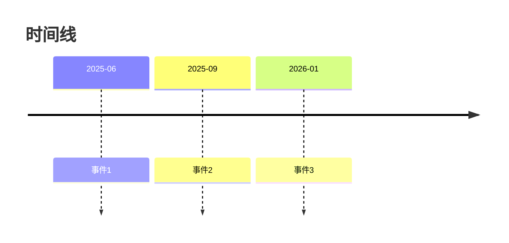
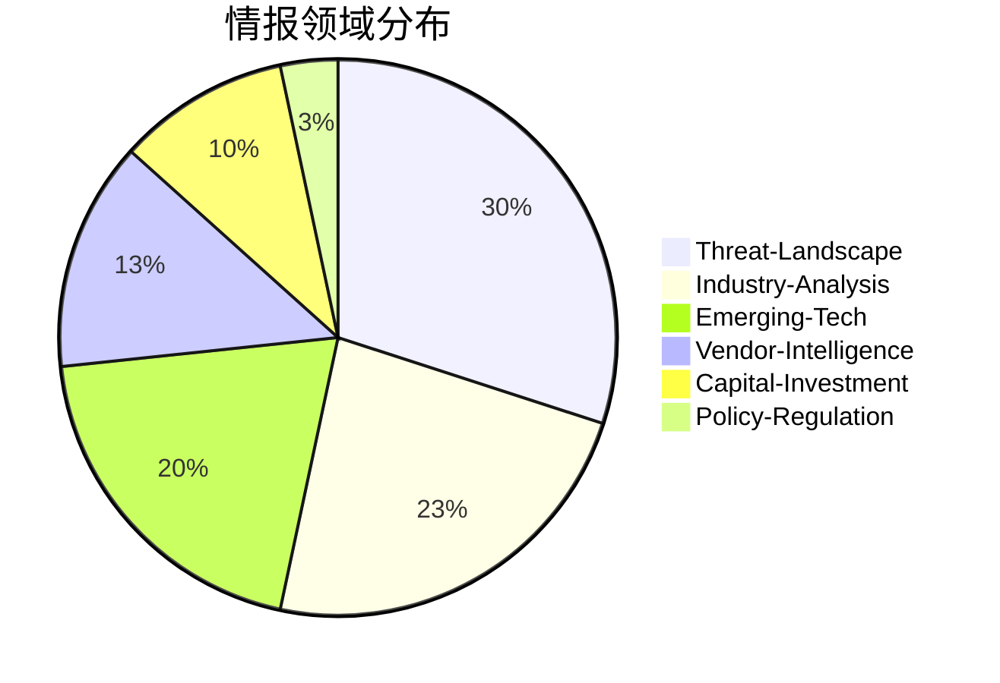
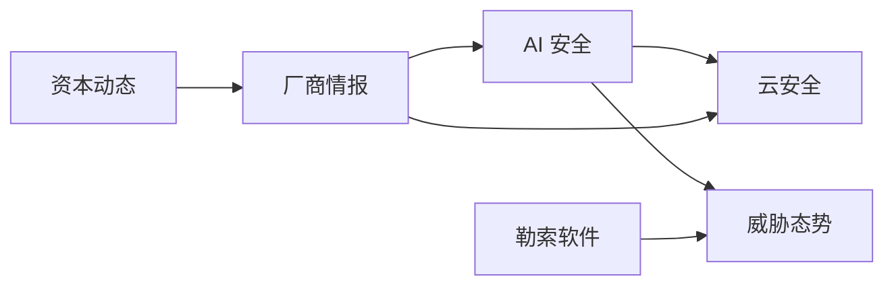

# Thematic Report Templates

> 主题报告和全景报告的完整模板定义

## 1. 主题报告模板

### 文件命名

`{theme-id}.md`（如 `ai-security.md`, `ransomware-threats.md`）

### 完整模板

```markdown
---
title: "主题名称"
theme_id: "theme-id"
generated_date: 2026-03-12
card_count: 25
date_range: "2025-06-01 ~ 2026-03-10"
domains: [Emerging-Tech, Threat-Landscape, Vendor-Intelligence]
keywords: [关键词1, 关键词2, 关键词3]
---

## 概览

[主题核心洞察，2-3 句话概括]

> 关键结论：[最重要的发现]

## 时间趋势

### 情报数量分布

| 时间段 | 情报数量 | 趋势 |
|--------|----------|------|
| 2025-Q4 | 8 | - |
| 2026-Q1 | 17 | ↑ |

### 热度变化

- **新兴关键词**：[关键词1]、[关键词2]
- **持续热点**：[关键词3]、[关键词4]
- **消退趋势**：[关键词5]

## 关键发现

### 发现 1：[发现标题]

[发现详细描述，包含数据支撑]

**数据支撑**：[具体数字、比例]

**情报来源**：[[相关卡片路径]]

### 发现 2：[发现标题]

[发现详细描述]

### 发现 3：[发现标题]

[发现详细描述]

## 实体网络

### 关键厂商

| 厂商 | 提及次数 | 核心动向 |
|------|----------|----------|
| 厂商A | 8 | 产品发布、融资 |
| 厂商B | 5 | 战略调整 |

### 威胁行为者

> 如适用，否则删除此节

| 组织 | 活跃度 | 攻击偏好 |
|------|--------|----------|
| 组织A | 高 | 目标行业 |

### 技术趋势

| 技术 | 成熟度 | 应用进展 |
|------|--------|----------|
| 技术A | 成长期 | 广泛采用 |

## 跨领域关联

本主题涉及以下情报领域的联动：

```
Emerging-Tech → Threat-Landscape
[新技术带来新威胁，具体说明]

Vendor-Intelligence → Capital-Investment
[厂商动态与资本市场的关联]
```

## 战略建议

### 建议 1：[建议标题]

**背景**：[为什么需要这个建议]

**行动项**：
- [ ] 具体行动 1
- [ ] 具体行动 2

**预期效果**：[实施后的预期收益]

### 建议 2：[建议标题]

[同上结构]

## 数据支撑

### 关键数据

| 指标 | 数值 | 时间 | 来源 |
|------|------|------|------|
| 市场规模 | 50亿美元 | 2026 | Gartner |
| 年增长率 | 35% | 2026 | 行业分析 |

### 可视化数据



## 情报来源

共引用 {{card_count}} 张情报卡片：

| 日期 | 标题 | 领域 |
|------|------|------|
| 2026-03-01 | [标题](卡片路径) | Emerging-Tech |

---

*本报告由 Market Radar 自动生成于 {{generated_date}}*
```

---

## 2. 全景报告模板

### 文件命名

`{YYYYMM}-panorama.md`（如 `202603-panorama.md`）

### 完整模板

```markdown
---
title: "网络安全情报全景"
generated_date: 2026-03-12
period: "2026年3月"
total_cards: 150
themes_count: 5
domains_covered: [Threat-Landscape, Industry-Analysis, ...]
---

## 全景概览

[整体态势描述，3-5 句话]

> **核心洞察**：[最重要的全局面发现]

## 领域分布

### 情报数量分布

| 领域 | 数量 | 占比 | 趋势 |
|------|------|------|------|
| Threat-Landscape | 45 | 30% | ↑ |
| Industry-Analysis | 35 | 23% | → |
| Emerging-Tech | 30 | 20% | ↑ |
| Vendor-Intelligence | 20 | 13% | ↓ |
| Capital-Investment | 15 | 10% | → |
| Policy-Regulation | 5 | 4% | → |

### 领域分布图



## 热点主题

### AI 安全

**情报数量**：25 张

**核心发现**：
- AI 安全市场快速增长，年增长率超过 30%
- 提示注入成为最受关注的 AI 安全威胁

[详细报告](./ai-security.md)

### 勒索软件威胁

**情报数量**：18 张

**核心发现**：
- LockBit 仍是最大威胁，但执法行动影响其运营
- 勒索软件即服务(RaaS)模式持续演化

[详细报告](./ransomware-threats.md)

### 云安全

**情报数量**：15 张

**核心发现**：
- SASE 架构成为主流趋势
- 云原生安全需求快速增长

[详细报告](./cloud-security.md)

## 跨主题洞察

### 主题关联网络



### 关键联动

1. **AI 安全 ↔ 云安全**：AI 能力正在集成到云安全产品中
2. **勒索软件 ↔ 威胁态势**：勒索软件攻击推动整体威胁水平上升
3. **厂商情报 ↔ 资本动态**：安全厂商融资活动推动技术发展

## 战略建议汇总

### 近期行动（0-3个月）

| 优先级 | 建议主题 | 具体行动 |
|--------|----------|----------|
| 高 | AI 安全 | 建立AI安全测试能力 |
| 高 | 勒索软件 | 更新应急响应预案 |

### 中期规划（3-12个月）

| 优先级 | 建议主题 | 具体行动 |
|--------|----------|----------|
| 中 | 云安全 | 评估SASE架构迁移 |
| 中 | 厂商情报 | 梳理核心供应商关系 |

## 主题报告索引

| 主题 | 情报数量 | 主要领域 | 报告链接 |
|------|----------|----------|----------|
| AI 安全 | 25 | Emerging-Tech | [查看](./ai-security.md) |
| 勒索软件威胁 | 18 | Threat-Landscape | [查看](./ransomware-threats.md) |
| 云安全 | 15 | Emerging-Tech | [查看](./cloud-security.md) |

---

*本报告由 Market Radar 自动生成于 {{generated_date}}*
```

---

## 3. 报告生成指南

### 数据填充规则

| 占位符 | 数据来源 | 示例 |
|--------|----------|------|
| `{{card_count}}` | 分析材料 | 25 |
| `{{generated_date}}` | 当前日期 | 2026-03-12 |
| `{{theme_id}}` | 主题配置 | ai-security |
| `{{date_range}}` | 分析材料 | 2025-06-01 ~ 2026-03-10 |

### 条件渲染

- 如果 `entities.threat_actors` 为空，删除"威胁行为者"章节
- 如果 `cross_domain_links` 为空，简化"跨领域关联"章节
- 如果 `key_findings` 少于 3 条，合并展示

### 格式规范

- 使用 Obsidian 兼容的 WikiLink 格式：`[[路径]]`
- 表格使用标准 Markdown 格式
- Mermaid 图表使用标准语法
- 中文与英文/数字之间保留空格